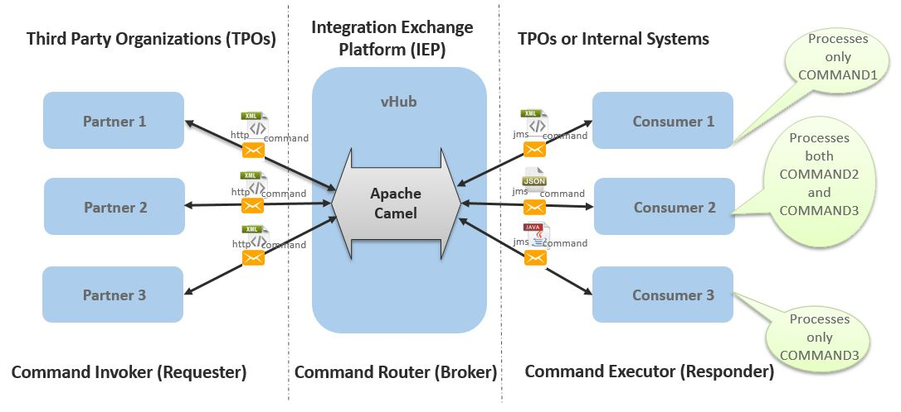

# vHub
---
Virtusa Hub service PoC

### Requirement
---

#### Requirement Overview



#### Requirement Detail

1. Create an integration exchange platform (IEP) called "vHub", three command invokers/partners (third party organizations), and three command executors/consumers (third party organizations/internal systems)
2. vHub shall expose a REST web service to receive "commands" from external partners (TPOs).
	1. Use POST HTTP method
	2. HTTP body will be XML (just create a random structure)
	3. HTTP header: "**CommandType**" (assume a simple String value that maps to a known enum).  Possible values: Command1, Command2, and Command3.
	4. HTTP header: "**CommandCallbackUrl**"

3. Create 3 different "consumers" to receive and process the incoming commands.
	1. Consumer1 needs to receive only Command1, Consumer2 receives both Command2 and Command3, and Consumer3 receives only Command3.
	2. Each consumer should simply print out the command payload.  But the point here is that each would be independently "doing something" with the command, based on their isolated needs.
	3. Each partner should have its own exposed REST web service to receive "final response" callbacks.

4. Create 3 different "external partners" to send the commands and receive back the "final response" callbacks.
	1. Realistically, feel free to skip the part where they send in the actual commands.  You can simply emulate this using Postman (nifty Chrome app) or SoapUI.
	2. Main point here is we need 3 partners with exposed callback REST web service endpoints.

5. Facilitate a flow of two-phased responses.  The main point here is that command processing can frequently take quite a while to finish, especially when a large data warehouse is involved.  Since HTTP or JMS calls will have long since timed out, we need two different responses.  Since our "processing" is purely logging the command, this seems silly, but bare with me and appreciate the concepts (wink)
	1. When a consumer receives a command to be processed, it should immediately respond with an "initial response".  This is essentially an "ok, successfully received the command and will process it now".  Again, make up another XML payload.
	2. vHub provides the initial response back to the external partner as the HTTP response to their original call.  But, since the command could potentially be received by multiple consumers, this response needs to "aggregate" (hint hint hint) all the consumer initial responses into a single payload.
	3. When the consumer has finished processing the command, it asynchronously sends a "final response" back to vHub using Callback Async model.  This response needs to include: 
		1. Another XML body (make something up) The original "CommandCallbackUrl", as a header
		2. vHub receives the final response, then forwards the message to the original external partner using the CommandCallbackUrl

6. Exception handling
	1. If a consumer is unreachable, camel-http4 will throw an Exception.  The initial response aggregator will need to catch this and include the exception message in the aggregated response.  This lets the external partner know that 1..n consumers did not successfully process the message.
	2. If a partner catches an Exception within its own internal processing, but after it's already replied with the initial response, that Exception message should be provided as the final response payload.
	3. If vHub itself throws an Exception, simpy catch and log it.
	4. Provide a means to throw Exceptions to test each requirement:
		1. For "a", we can simply stop that Bundle in Karaf, rendering it unreachable
		2. For "b" and "c", provide some sort of trigger.  For example, allow the original command call to include a "ShouldPartnerFail" or "ShouldHubFail" header.  If true, throw some custom Exception in the relevant spot.

7. Payload validation
	1. All XML payloads mentioned throughout this PoC, even though made up, shall have an accompanying XSD (housed in vHub itself).
	2. vHub shall be responsible for validating command XML and all response XML against the known XSD.  Use either Camel's built in validation mechanism, or a Processor using straight JAXB.
	3. Invalidation Exceptions should be handled by #6's flow.

8. Communication between vHub and the consumers must occur purely over ActiveMQ queues
	1. Install the "activemq" feature in Karaf – it instantiates a simple ActiveMQ broker within the container.
	2. All bundles connect to that central broker!
	3. Hint: the command and initial response flow will need to use "replyTo"

9. Pull applicable deets into a Karaf configuration file (KARAF_HOME/etc/*.cfg), then reference those properties in the bundles, rather than hardcoding everything.  Ideas: REST web service endpoints, queue names, etc.

10. All REST web services must be exposed and consumed using CXF-RS

11. All REST web service requests should be sent through camel-http4

12. All components must be implemented as separate OSGi bundles

13. All components must run on Karaf

14. All components should be installed in Karaf using one or more "feature files", rather than just installing all bundles and their dependencies piecemeal.

15. Use the latest versions of the upstream, Apache community projects (not the actual RH Fuse portfolio)

16. Unit testing
	1. Don't worry about unit testing everything.  Just use the below as a way to work with the unit testing concepts
	2. Use Camel's unit testing framework to test the end-to-end flow of the vHub component
	3. Hit the REST web service endpoint using WebClient and verify the initial response
	4. Use Camel's mock framework to mock out the consumer queues.  Verify the mock's received Exchanges.
	5. Also mock out the camel-http4 callback URL step, verifying those Exchanges as well

17. Commit everything to your own personal GitHub repo!  Not only is this good practice, but it'll benefit others.
	1. Include a README.md describing what the tutorial code demonstrates
	2. Commit early and commit often!  This isn't SVN.  Don't hold your code until it's finished!

#### Nice to Haves

The goal of the PoC is to give an adequate intro to concepts, not to holistically cover all topics.  That being said, if time allows, here are some additional, useful items to incorporate.

1. Allow consumers to speak different message formats, other than all-XML.  For example, Consumer3 could utilize JSON.  That would require all outgoing commands and incoming responses to be converted.

2. Introduce an external partner that cannot communicate using REST pushes.  Instead, vHub must poll the partner, using a configurable time interval, retrieving results and pushing them into the rest of the flow.  This external "partner" could be another REST web service, a JDBC query, etc.  

3. Integration test.  Create a separate integration testing project, based on Pax Exam, that starts all bundles and verifies their state.  In addition, some lightweight blackbox testing would be beneficial.

### Technology Stack
---
|Category |Technology/Framework|	Version|
|----------|--------------------|---------|
|Java SE|	Oracle JDK|	7|
|MQ Broker|	Apache ActiveMQ|	5.13.3|
|Web Services (JAX-RS : 2.x)|	Apache CXF|	3.1.5|
|Integration Framework|	Apache Camel|	2.16.3|
|Runtime Container|	Apache Karaf|	4.0.5|
|OSGi Framework (OSGi: 6.0.0)|	Apache Felix|	5.4.0|
|OSGi DI Specification (Blueprint)|	Apache Aries|	1.6.1|


### API/Framework Dependency Installation
---
Add feature repositoris
```sh
repo-add cxf 3.1.5
repo-add camel 2.16.3
repo-add activemq 5.13.3
```
Install features
```sh
install webconsole
install cxf-jaxrs/3.1.5
install camel-jms/2.16.3 camel-cxf/2.16.3 camel-jaxb/2.16.3 camel-jackson/2.16.3 camel-http4/2.16.3
install activemq-client/5.13.3 activemq-broker/5.13.3 activemq-camel/5.13.3
```

### vHub Feature Installation
---
Add feature repository
```sh
repo-add mvn:com.virtusa.vhub/vhub-parent/0.0.1-SNAPSHOT/xml/features
```
Install features
```sh
install vhub-all
```
Uninstall features
```sh
uninstall vhub-all
```
